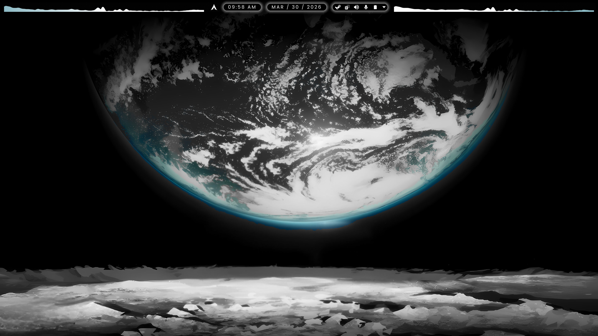
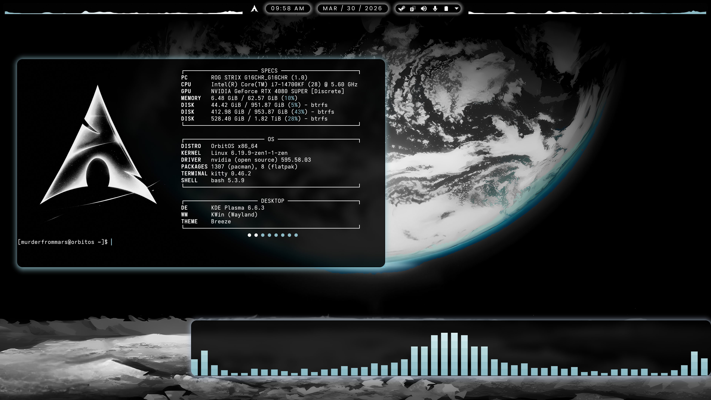

# Lunar Glass — Frosted Glass Plasma Theme

**Lunar Glass** is a frosted glass aesthetic theme for **KDE Plasma 6** that transforms Plasma into a polished, dynamic tiling window manager (TWM) setup with translucent space themed visuals and productivity-focused workflow enhancements.

Lunar Glass integrates advanced visual effects, KWin scripts, and curated configurations to deliver a fully immersive glass-panel desktop experience.




---

## Quick Install

The easiest way to install Lunar Glass on your system:
```bash
curl -fsSL https://raw.githubusercontent.com/MurderFromMars/Lunar-Glass/main/install.sh | bash
```

This command downloads the installer and deploys the full Lunar Glass environment automatically.

---

## Features

**Visual Enhancements:**
- CosmicMonochromia color scheme (`CosmicMonochromia.colors`)
- Custom accent color (#8cbac5)
- YAMIS icon theme
- Modern Clock Plasma widget
- Custom wallpapers and icons

**Window Management:**
- **Krohnkite:** dynamic tiling KWin script
- **Kyanite:** true GNOME-style dynamic workspace management for Plasma 6, authored by me
- Plasma panel colorizer
- Kurve Cava powered audio visualizer for KDE Panels
- KDE Rounded Corners custom window rounding and shadow/border effects
- Better Blur DX for blur effects on transparent windows

**Configuration Management:**
- Automatic backup of your configuration files
- Deployment of preconfigured Plasma and KWin configuration files including btop, kitty, fastfetch, and cava configurations
- Auto rebuild system for KDE Rounded Corners and Better Blur DX after KWin updates

**Advanced Automation:**
- Removes existing Plasma panels safely during deployment
- Applies Breeze window decoration automatically
- Sets wallpapers programmatically (via `plasma-apply-wallpaperimage` or JavaScript fallback)
- Reconfigures KWin automatically after changes

---

## Supported Platforms

- **Arch / Arch-based**
- **Debian / Ubuntu-based**
- **Fedora-based**

**Requirements:**
- KDE Plasma 6.x
- Bash shell
- Active Plasma session
- Internet connectivity
- Sudo privileges
- Wayland only

---

## Technology Highlights

- **Bash Automation:** orchestrates builds, configuration, and deployment
- **KDE JavaScript Integration:**
  Lunar Glass uses inline JavaScript via `qdbus6` to:
  - Remove live Plasma panels
  - Set wallpapers programmatically
  - Interact with KDE Plasma APIs directly

- **Source Builds:**
  Components like `KDE Rounded Corners`, `Better Blur DX`, `Kurve`, and `Plasma Panel Colorizer` are built from source for performance and stability.

- **Auto Rebuild Hooks for KDE Rounded Corners & Better Blur DX:**
  Lunar Glass ensures compatibility after KWin updates:
  - **Arch:** pacman hook executes `/usr/local/bin/rebuild-kwin-effects.sh` post-kwin upgrade
  - **Debian/Ubuntu:** APT post-invoke hook triggers rebuild if kwin packages were updated
  - **Fedora:** DNF post-transaction action triggers rebuild on kwin-wayland install/update

---

## Installation Details

Lunar Glass performs the following phases automatically:

### Phase 1: System Preparation
- Clone or update the Lunar Glass repository
- Detect Linux distribution
- Install system dependencies (Arch, Debian-based, or Fedora-based)

### Phase 2: Building Core Components
- Compile Plasma Panel Colorizer, Kurve, KDE Rounded Corners, and Better Blur DX
- Set up auto-rebuild scripts for KDE Rounded Corners and Better Blur DX

### Phase 3: Theme Deployment
- Stop PlasmaShell and remove old panels
- Deploy icons, wallpapers, color schemes, and widgets
- Apply preconfigured Plasma and KWin configuration files
- Set active wallpaper
- Activate KWin scripts:
  - **Krohnkite:** dynamic tiling
  - **Kyanite:** true GNOME-style dynamic workspace management, fully dynamic and adaptable to your workflow
- Enforce Breeze window decoration
- Reconfigure KWin and restart PlasmaShell

---

## Backup Strategy

All modified files are backed up to:
```
~/Lunar-Glass-backup-YYYYMMDD_HHMMSS
```

This allows you to restore previous configurations manually if needed.

---

## Post-Installation

- **Logout or reboot** is required to fully apply all theme and script changes.
- The installer will indicate when this step is necessary.

---

## Maintenance

- Automatic rebuild hooks ensure KDE Rounded Corners and Better Blur DX remain compatible after KWin updates:
  - Arch: pacman hook
  - Debian/Ubuntu: APT post-invoke hook
  - Fedora: DNF post-transaction action
- Rebuild logs are saved at:
```
/var/log/kde-rounded-corners-rebuild.log
/var/log/better-blur-dx-rebuild.log
```

---

## Audience

**Intended for:**
- KDE Plasma 6 enthusiasts
- Users seeking a clean glass-panel dynamic tiling workflow
- Anyone on supported Linux distributions who wants a polished dynamic TWM desktop with the creature comforts of Plasma

---

## License

Lunar Glass is distributed under the MIT license. All projects built by, or included in, the script retain their original licensing.
